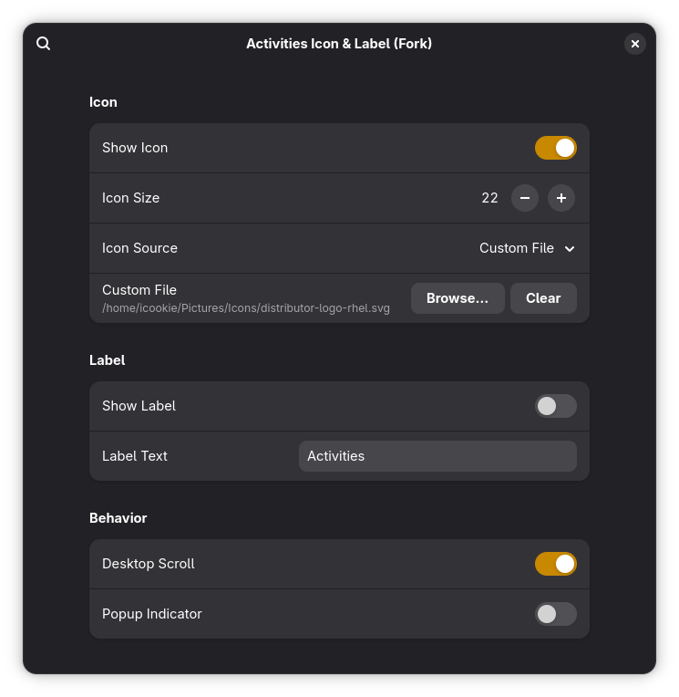

# Logo Activities

A GNOME Shell extension that replaces the default "Activities" button with a customizable icon and/or text label, with integrated workspace indicator dots.

## Features

- Replace the Activities button with a custom icon (named or file-based)
- Show a text label instead of or alongside the icon
- Integrated workspace indicator dots matching GNOME's default style
- Scroll on the button to switch workspaces
- Optional workspace switcher popup overlay
- Adjustable icon size (16–32 px)

## Screenshots




## Installation

### From source

```bash
git clone https://github.com/icookie-tea/Logo-Activities.git
rm -rf ~/.local/share/gnome-shell/extensions/logoactivities@icookie-tea.github.com
cp -r logoactivities@icookie-tea.github.com ~/.local/share/gnome-shell/extensions/
gnome-extensions enable logoactivities@icookie-tea.github.com
```

### Restart GNOME Shell

On X11: press `Alt+F2`, type `r`, press Enter.
On Wayland: log out and back in, or use a nested session for development.

## Preferences

Open the preferences UI:

```bash
gnome-extensions prefs logoactivities@icookie-tea.github.com
```

Available settings:
- **Icon**: Show/hide, set size, choose named icon or custom file
- **Label**: Show/hide, customize text (replaces workspace dots when enabled)
- **Behavior**: Scroll to switch workspaces, popup indicator on scroll

## Compatibility

GNOME Shell 48–51

## About

This extension was developed with the assistance of LLM and is intended for personal use.

## License

GPL-2.0-or-later
